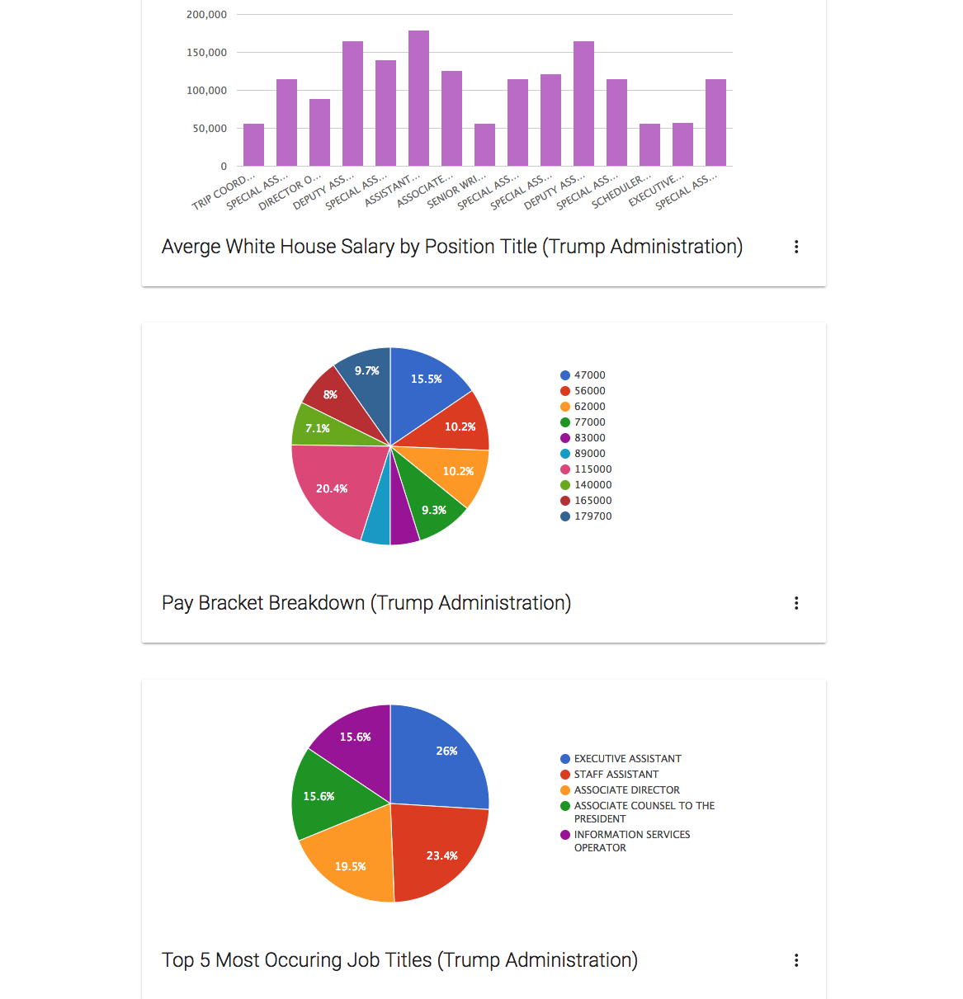
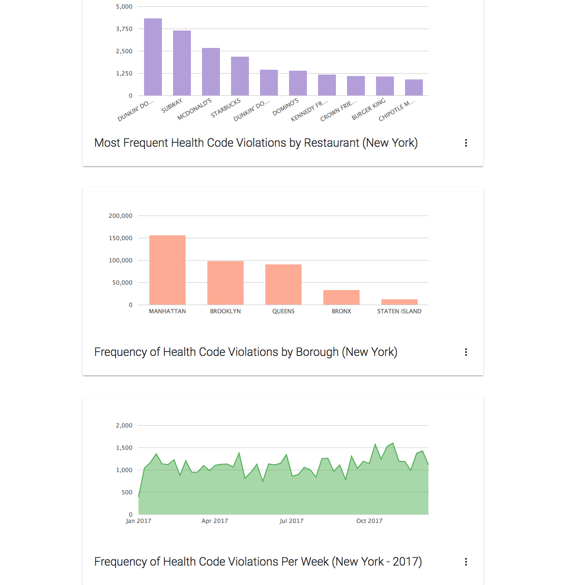

#Rails Data Visualization
=====================

## Keegan Ruebling

Description:
------------
A data visualization application that takes a csv file and runs a rake task to import it into Active Record. Once there, Chartkick returns the data in different graphs and charts.

## To Do

Project is currently a work in progress
  1. Deploy to Heroku
  2. Add Tagging for different charts
  3. Add user email services
  4. Integrate Google charts
  5. Integrate D3

copyright Keegan Ruebling © 2017
